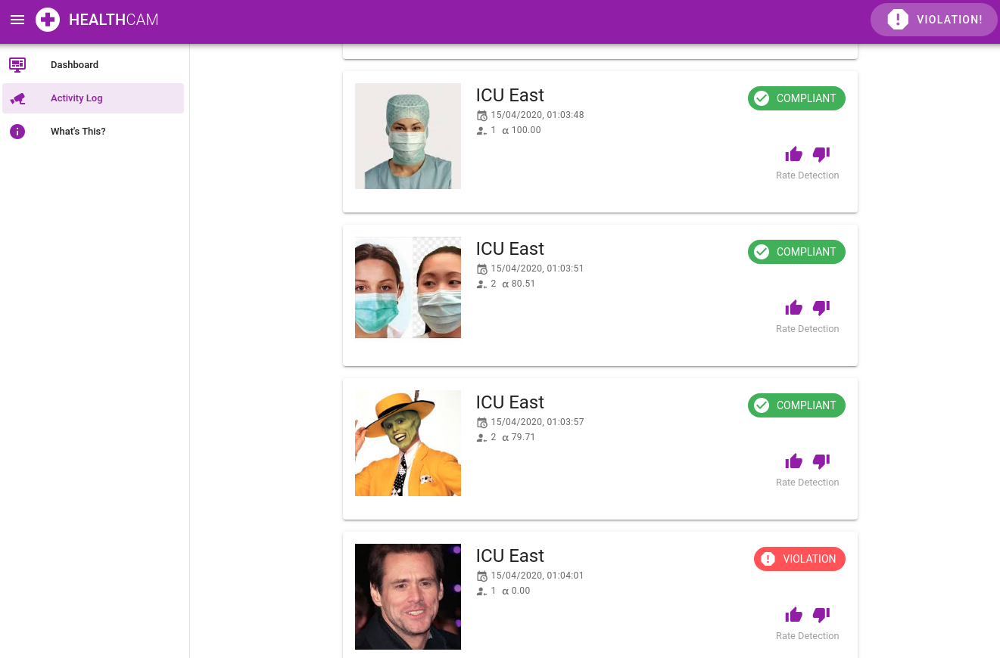

# Mask Detect

## About

## Diagrams

### AWS Architecture

### Circuit Diagram

## Inspiration

## Setup
We've written extensive documentation on how to set this up
[1. Setup AWS CLI]
[2. Setup Model Endpoint]
[3. Setup FrontEnd]
[4. Setup Raspberry Pi]

## Challenges we ran into
### GreenGrass Setup

## What we learnt

## Whats next
* Authenticating a user to access specific devices
* Trialing on non 
