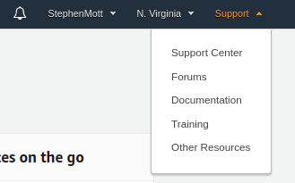
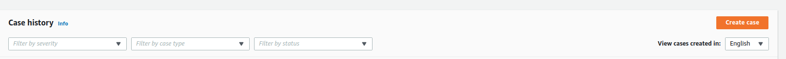

# TODO
This is most likely UI based


# Request AWS Limits
Before you'll be able to create the model you'll need to request your service limits to be increased, to allow you to host a ```ml.p3.2xlarge``` SageMaker hosting instence.




# Subscribe to model
Subscribe to the [PPE Detector for Worker Safety](https://aws.amazon.com/marketplace/pp/prodview-6gvzwuebead3o?ref_=_ml_hackathon)
. At time of writing there is a 30 day trial for this.


# Create required roles
#TODO create the reole

export execution_role_arn=
export model_name=YOUR_MODEL_NAME
export endpoint_name=YOUR_ENDPOINT_NAME

# Setup Model Endpoint.
```
aws sagemaker create-model --model-name ${model_name} --execution-role-arn ${execution_role_arn} --primary-container ModelPackageName=$arn:aws:sagemaker:us-east-1:865070037744:model-package/vitechlab-ppe-model-v3-1-290ec9dbb1ff9b555c3e5e6831fe4769 --region us-east-1
```

aws sagemaker create-endpoint-config --endpoint-config-name ${model_name} --production-variants VariantName=variant-1,ModelName=${model_name},InstanceType=ml.p3.2xlarge,InitialInstanceCount=1 --region us-east-1


aws sagemaker create-endpoint --endpoint-name ${model_name} --endpoint-config-name ${model_name} --region us-east-1
```
Check endpoint
```
aws sagemaker describe-endpoint --endpoint-name ${model_name} --region us-east-1
```
